# ansible-dz03 (tag: 08-ansible-03-yandex)

 **<mark>Домашнее задание к занятию 3 «Использование Ansible»</mark>**

Написан playbook добавил lighthouse
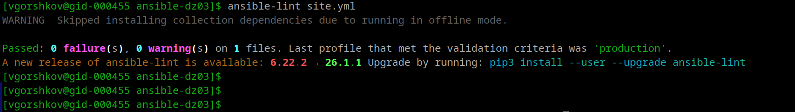

Проверка выявила "Так, теперь упал click"  
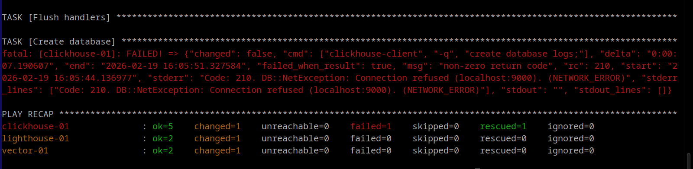

Проверка с ключом --diff
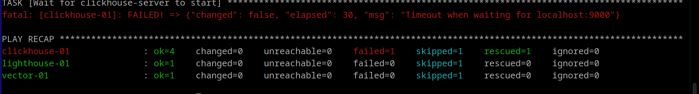

Проверяем в ручном режиме... (для выявления что со службой click*, далее машина была перезагружена и так как выяснил что служба просто не переходит в systemctl enable - то был добавлен блок для установки автозапуска).
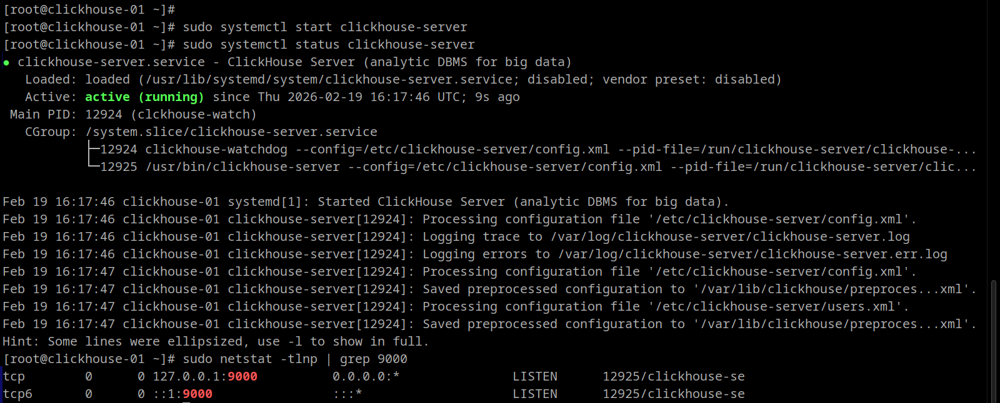

Служба не была в статусе enabled. починил, идем дальше.

Установка ansible-playbook -i inventory/prod.yml site.yml
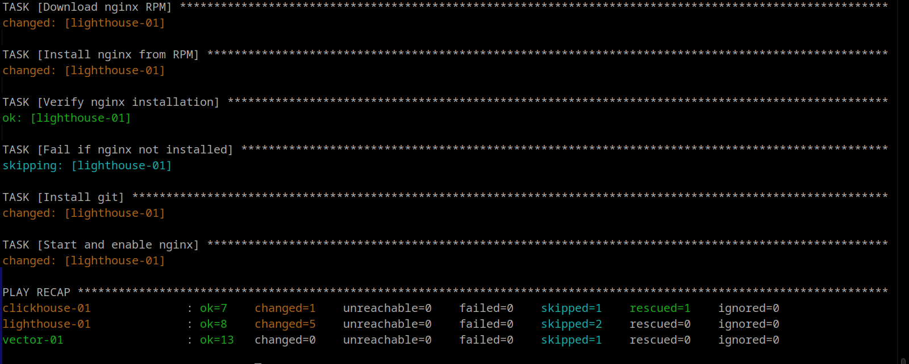
Готов. Установка завершена.
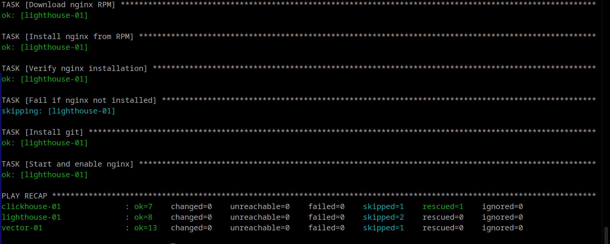

Далее...    проверим с ansible-lint site.yml 
Норм:
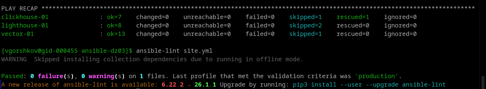

Запустить playbook на этом окружении с флагом --check
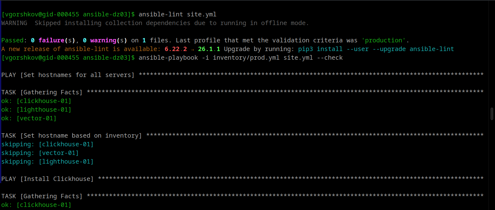
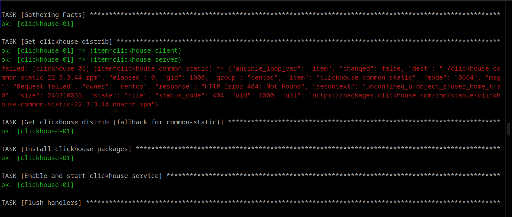
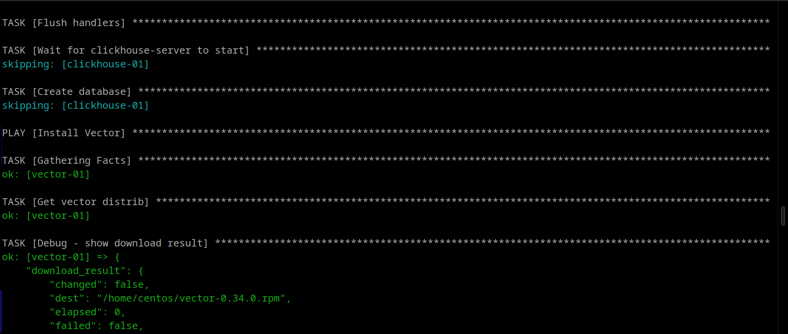

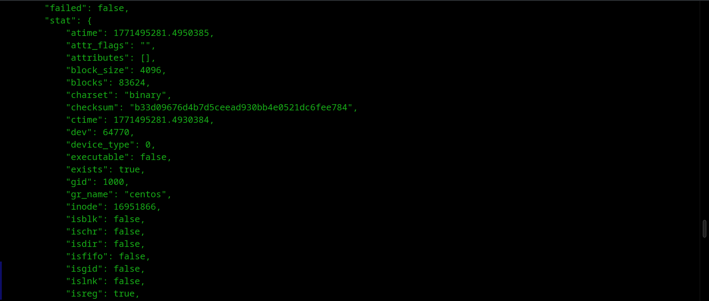
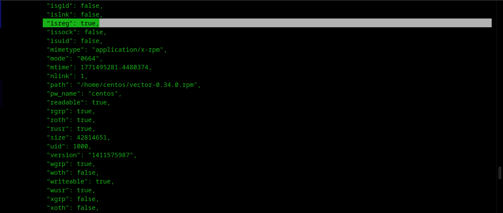
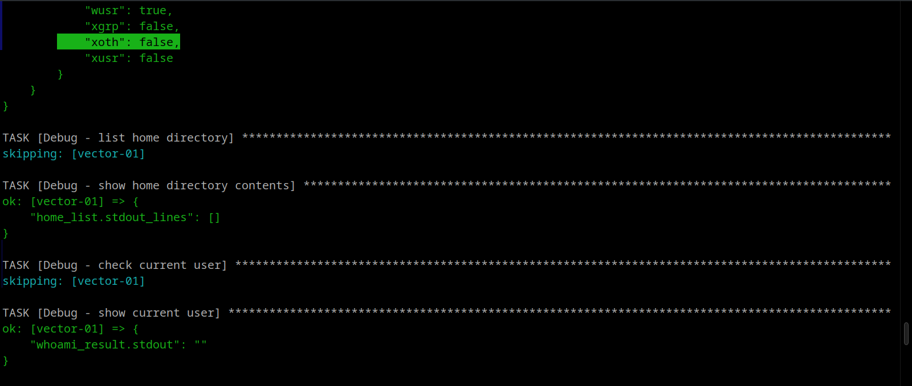
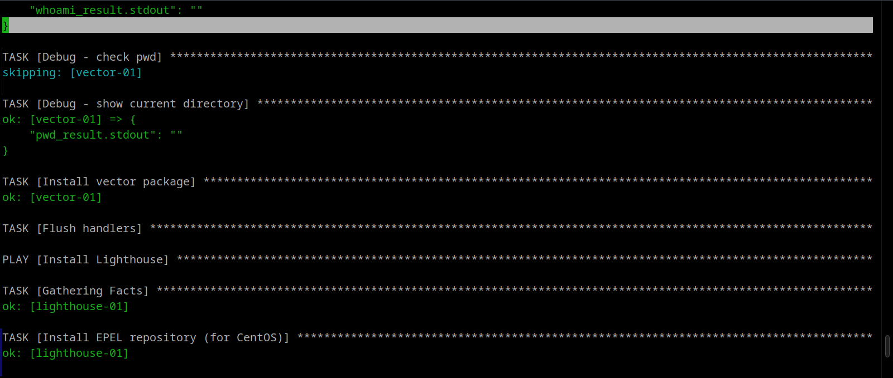
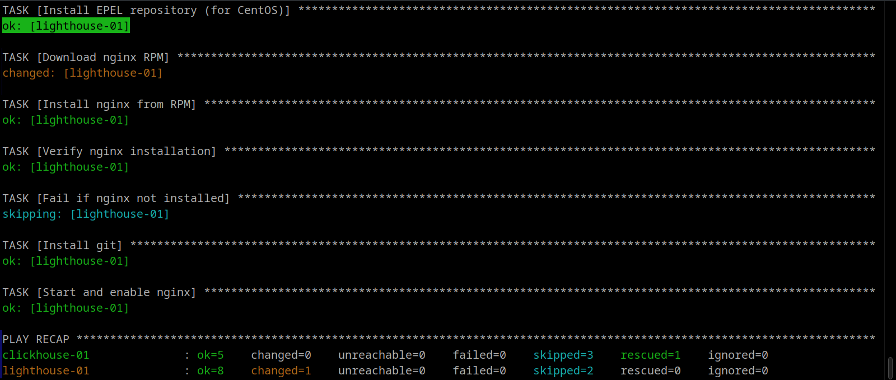
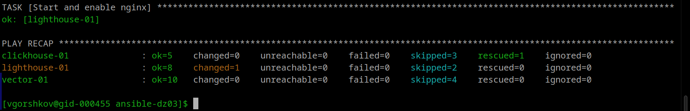

Проверяем c --diff
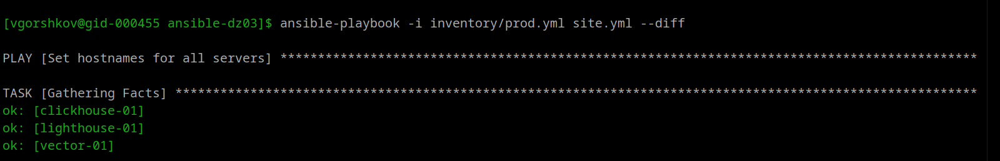
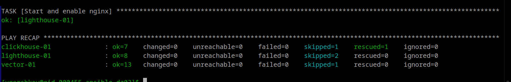

     <mark>**Описание Play Book**</mark>

1. **Clickhouse**
   
   - Скачивание RPM пакетов
   
   - Установка через yum
   
   - Запуск и добавление в автозагрузку
   
   - Создание БД `logs
     
     

2- **Vector**

- Скачивание RPM пакета

- Установка через yum

- Запуск сервиса
  
  

3- **Lighthouse**

- Установка EPEL репозитория

- Скачивание и установка nginx из RPM

- Установка git

- Клонирование репозитория Lighthouse

- Настройка nginx

- Открытие порта в firewall
  
  Playbook полностью идемпотентен - повторный запуск не вносит изменений в уже настроенную систему.
  
  

<mark>**Playbook поддерживает теги для запуска отдельных сервисов:**</mark>

**Установка Clickhouse**
ansible-playbook -i inventory/prod.yml site.yml --tags clickhouse

**Установка Vector**
ansible-playbook -i inventory/prod.yml site.yml --tags vector

**Установка Lighthouse**
ansible-playbook -i inventory/prod.yml site.yml --tags lighthouse

**Установка NGINx**
ansible-playbook -i inventory/prod.yml site.yml --tags nginx

Playbook автоматизирует установку и настройку трех сервисов:

- **Clickhouse** - колоночная БД для аналитики
- **Vector** - инструмент для сбора и отправки логов
- **Lighthouse** - веб-интерфейс для Clickhouse
  
  

**<mark>Структура проекта</mark>**

[vgorshkov@gid-000455 ansible-dz03]$ tree
.
├── group_vars
│   ├── clickhouse
│   │   └── vars.yml
│   ├── lighthouse
│   │   └── vars.yml
│   └── vector
│       └── vars.yml
├── image-N.png
├── image-..png
├── image-2.png
├── image-1.png
├── image.png
├── inventory
│   └── prod.yml
├── README.md
├── requirements.yml
├── site.yml
└── templates
    └── lighthouse_nginx.conf.j2

6 directories, 29 files

`site.yml` - основной playbook

`inventory/prod.yml` - инвентарный файл с хостами

`group_vars/` - директория с переменными для групп хостов

`templates/` - шаблоны конфигурационных файлов

Оформлено с помощью marktext-x86_64.AppImage

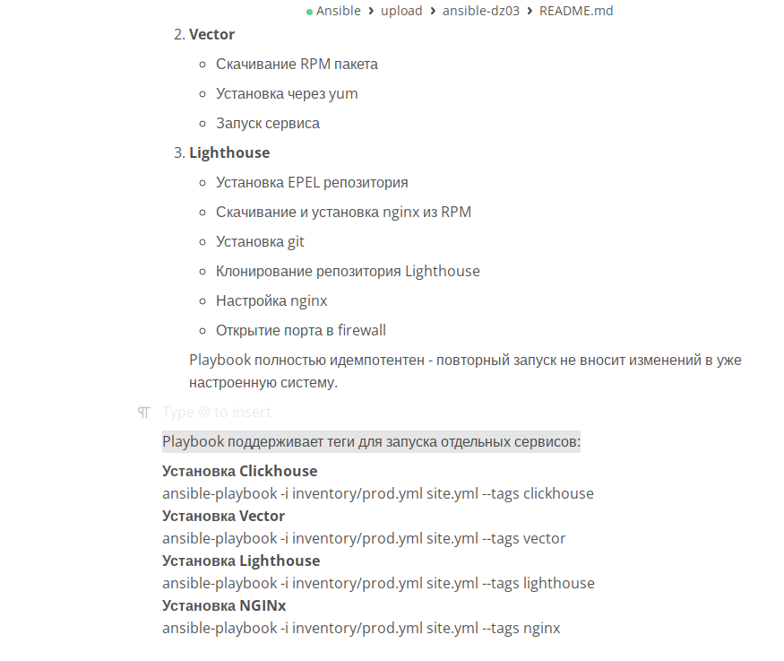
